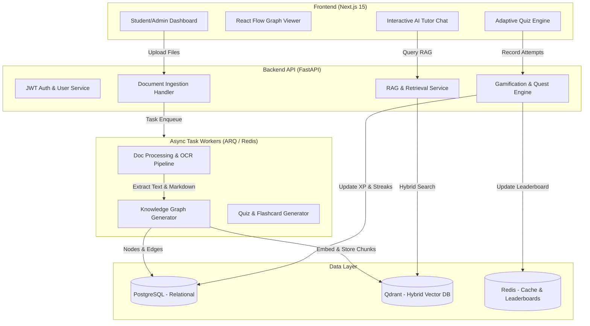

# Technical Feasibility Analysis & Implementation Plan: Questify

Questify is an AI-powered, gamified learning platform that converts uploaded study materials into personalized learning roadmaps, interactive knowledge graphs, active recall flashcards, adaptive quizzes, and AI tutor assistance.

---

## 1. Executive Summary & Feasibility Analysis

### Overall Verdict: **FEASIBLE with strategic refinements**

The proposed tech stack is well-engineered, modern, and perfectly suited for building an enterprise-grade AI learning platform. Below is the detailed breakdown:

| Component | Proposed Tech | Feasibility & Technical Assessment |
| :--- | :--- | :--- |
| **Frontend** | Next.js, React, TypeScript | **100% Feasible (Optimal).** Next.js (App Router) with TypeScript provides server-side rendering for speed/SEO, seamless WebSocket/SSE streaming for AI responses, and modular layout management for Student vs. Admin roles. |
| **Backend** | FastAPI (Python) | **100% Feasible (Optimal).** Async Python microservices framework with native Pydantic integration, ideal for heavy async I/O, AI model pipelines, and API routing. |
| **AI Agent Orchestration** | LangGraph | **100% Feasible (Optimal).** Stateful, cyclic graph orchestration allows complex agent workflows (e.g., adaptive quiz feedback loops, graph generation, multi-step tutoring). |
| **RAG & Indexing** | LlamaIndex | **100% Feasible (Optimal).** Industry standard for hierarchical document parsing, parent-child chunk indexing, and structured metadata retrieval. |
| **LLM Runtime** | Ollama | **Feasible for Dev / Conditional for Production.** Excellent for zero-cost local development and data privacy. *Constraint:* Local LLM execution requires significant GPU resources under concurrent user load. |
| **Vector DB** | Qdrant | **100% Feasible (Optimal).** Blazing fast payload-filtered vector search with native hybrid (Dense + Sparse/BM25) support. |
| **Primary Database** | PostgreSQL | **100% Feasible (Optimal).** Reliable relational storage for users, authentication, courses, quests, achievements, and mastery scores. |
| **Cache & Task Queue** | Redis | **100% Feasible (Optimal).** Essential for fast session caching, async task queue (ARQ/Celery), and real-time leaderboards via Redis `ZSET`. |
| **OCR & Processing** | PaddleOCR, PyMuPDF, pdfplumber, python-docx | **100% Feasible.** High performance extraction for standard PDFs, DOCX, and scanned documents. |
| **Containerization** | Docker / Compose | **100% Feasible.** Ensures reproducible development and multi-container orchestration. |

---

## 2. Tech Stack Recommendations & Enhancements

Is there a better stack? The chosen stack is already near-optimal. However, the following **strategic enhancements** will elevate performance, developer experience, and scalability:

```
+-----------------------------------------------------------------------------------+
|                            RECOMMENDED ARCHITECTURE SCHEME                        |
+-----------------------------------------------------------------------------------+
|  [ Next.js 15 App Router + React Flow + TailwindCSS / Custom Styling ]            |
|                                         | (REST / SSE / WebSockets)               |
|  [ FastAPI Async API Engine ] <--------> [ Redis Queue / ARQ Worker ]             |
|          |                                          |                             |
|          +---> [ PostgreSQL ] (Relational State)    +---> [ PyMuPDF + Docling ]   |
|          |                                          |     (Unified Document OCR)|
|          +---> [ Qdrant Vector DB ]                 |                             |
|          |     (Hybrid Vector & Payload Search)     v                             |
|          |                                [ LlamaIndex + LangGraph Engine ]       |
|          v                                          |                             |
|  [ LiteLLM Router Layer ] --------------------------+                             |
|          |                                                                        |
|          +---> (Local Dev)  : Ollama (Llama 3.1 / Qwen 2.5 / DeepSeek-R1)           |
|          +---> (Production): Cloud LLMs (OpenAI GPT-4o / Gemini 2.0 / DeepSeek)   |
+-----------------------------------------------------------------------------------+
```

### Proposed Enhancements:
1. **LiteLLM Abstraction Layer for LLMs**:
   - Wrap `Ollama` behind a unified LiteLLM client layer. This allows local development using Ollama without code changes, while providing zero-downtime switching to cloud APIs (Gemini 2.0, OpenAI, DeepSeek) for production scale.
2. **Unified Document Parsing with Docling / Unstructured**:
   - Complement `PyMuPDF` and `PaddleOCR` with **Docling** (or `Unstructured`). Docling converts PDFs directly into clean Markdown retaining headers, formulas, and structural tables—vital for high-quality Knowledge Graph extraction.
3. **React Flow for Knowledge Graph Visualization**:
   - On the frontend, use **React Flow** or **3D Force-Graph** to render the node-edge prerequisite learning graph with smooth zooming, auto-layout algorithms (Dagre/D3-hierarchy), and interactive click-to-learn interactions.
4. **Spaced Repetition Engine (SuperMemo SM-2 Algorithm)**:
   - Implement the standard **SM-2 algorithm** for flashcard scheduling to continuously calculate retention decay and next review dates based on user response quality (0-5 rating).

---

## 3. Detailed Component Architecture & Data Flow



---

## 4. User Review Required & Design Decisions

> [!IMPORTANT]
> **Key Architectural Decisions to Confirm:**
> 1. **LLM Deployment Strategy**: Local-only via Ollama requires GPU infrastructure (e.g. RTX 4090 / A10G server) for fast responses. We recommend configuring LiteLLM to allow Ollama for local dev and cloud fallback for multi-tenant production load.
> 2. **Authentication Protocol**: JWT tokens with refresh tokens stored in HTTP-Only secure cookies for web security.
> 3. **Spaced Repetition Algorithm**: SuperMemo 2 (SM-2) for flashcard scheduling and adaptive revision planning.

---

## 5. Structured Implementation Plan (6 Phases)

---

### Phase 1: Core Foundation, Auth & Data Schemas

#### [NEW] [apps/api/app/db/session.py](file:///c:/Users/varsh/Downloads/Questify/apps/api/app/db/session.py)
#### [NEW] [apps/api/app/models/user.py](file:///c:/Users/varsh/Downloads/Questify/apps/api/app/models/user.py)
#### [NEW] [apps/api/app/models/gamification.py](file:///c:/Users/varsh/Downloads/Questify/apps/api/app/models/gamification.py)
#### [NEW] [apps/api/app/api/v1/auth.py](file:///c:/Users/varsh/Downloads/Questify/apps/api/app/api/v1/auth.py)
#### [NEW] [apps/web/src/app/(auth)/login/page.tsx](file:///c:/Users/varsh/Downloads/Questify/apps/web/src/app/(auth)/login/page.tsx)
#### [NEW] [apps/web/src/app/(dashboard)/layout.tsx](file:///c:/Users/varsh/Downloads/Questify/apps/web/src/app/(dashboard)/layout.tsx)

- **Backend**:
  - Implement PostgreSQL relational schema via SQLAlchemy 2.0 / SQLModel.
  - Entities: `User`, `Role`, `LearningMaterial`, `Course`, `KnowledgeNode`, `KnowledgeEdge`, `Flashcard`, `Quiz`, `UserProgress`, `Quest`, `Achievement`, `UserStreak`.
  - Secure password hashing using `passlib` with `bcrypt`.
  - JWT authentication with Access/Refresh token pair and HTTP-only cookie support.
- **Frontend**:
  - Build modern Next.js dashboard shell with dark/light themes.
  - Implement layout routes: `/dashboard`, `/roadmap`, `/tutor`, `/flashcards`, `/quizzes`, `/leaderboard`, `/admin`.

---

### Phase 2: Material Upload, OCR & Processing Pipeline

#### [NEW] [apps/worker/pipeline/parser.py](file:///c:/Users/varsh/Downloads/Questify/apps/worker/pipeline/parser.py)
#### [NEW] [apps/worker/pipeline/ocr.py](file:///c:/Users/varsh/Downloads/Questify/apps/worker/pipeline/ocr.py)
#### [NEW] [apps/worker/pipeline/chunker.py](file:///c:/Users/varsh/Downloads/Questify/apps/worker/pipeline/chunker.py)
#### [NEW] [apps/api/app/services/vector_store.py](file:///c:/Users/varsh/Downloads/Questify/apps/api/app/services/vector_store.py)

- **Processing Pipeline**:
  - File validator (PDF, DOCX, PPTX, TXT, PNG/JPG, size limits, MIME check).
  - PyMuPDF for fast native PDF text extraction + `pdfplumber` for tabular data.
  - `PaddleOCR` worker step for scanned pages/images.
  - Hierarchical node chunking (LlamaIndex SentenceSplitter / MarkdownNodeParser).
  - Vector generation and upload to Qdrant collection indexed with metadata (`course_id`, `material_id`, `chapter`, `page_number`).

---

### Phase 3: Knowledge Graph & Roadmap Generation Engine

#### [NEW] [apps/api/app/services/graph_service.py](file:///c:/Users/varsh/Downloads/Questify/apps/api/app/services/graph_service.py)
#### [NEW] [apps/api/app/services/roadmap_service.py](file:///c:/Users/varsh/Downloads/Questify/apps/api/app/services/roadmap_service.py)
#### [NEW] [apps/web/src/components/knowledge-graph/GraphViewer.tsx](file:///c:/Users/varsh/Downloads/Questify/apps/web/src/components/knowledge-graph/GraphViewer.tsx)
#### [NEW] [apps/web/src/components/roadmap/RoadmapWorlds.tsx](file:///c:/Users/web/src/components/roadmap/RoadmapWorlds.tsx)

- **AI Concept Graph Generator**:
  - LangGraph node extracts key entities, concepts, definitions, and prerequisite relationships (`Concept A is prerequisite of Concept B`).
  - Compute node depth to construct hierarchical **Worlds** (e.g. World 1: Fundamentals -> World 2: Intermediate -> World 3: Advanced) and **Levels**.
- **Interactive Visualizations**:
  - Frontend component powered by **React Flow** with interactive nodes, mastery indicators, unlock constraints, and drill-down detail drawers.

---

### Phase 4: Grounded AI Tutor, Flashcard & Adaptive Quiz Engines

#### [NEW] [apps/api/app/services/ai_tutor.py](file:///c:/Users/varsh/Downloads/Questify/apps/api/app/services/ai_tutor.py)
#### [NEW] [apps/api/app/services/flashcard_engine.py](file:///c:/Users/varsh/Downloads/Questify/apps/api/app/services/flashcard_engine.py)
#### [NEW] [apps/api/app/services/adaptive_quiz.py](file:///c:/Users/varsh/Downloads/Questify/apps/api/app/services/adaptive_quiz.py)
#### [NEW] [apps/web/src/app/(dashboard)/tutor/page.tsx](file:///c:/Users/web/src/app/(dashboard)/tutor/page.tsx)

- **AI Tutor (RAG + LangGraph)**:
  - Hybrid search retrieval from Qdrant with citation attribution.
  - Streaming responses using SSE (Server-Sent Events) in FastAPI.
  - Support for multi-turn conversation memory, code explanation, and concept comparison.
- **Flashcard Active Recall Engine**:
  - Auto-generation of flashcards with structured JSON schema (Front, Back, Concept ID, Hints).
  - Implementation of SM-2 spaced repetition algorithm for optimal revision scheduling.
- **Adaptive Quiz Engine**:
  - Multiple question formats (Multiple Choice, True/False, Fill-in-the-blank, Code snippet analysis).
  - Dynamic difficulty calibration (Easy, Medium, Hard, Boss Level) based on historical accuracy.

---

### Phase 5: Gamification Engine & Progress Analytics

#### [NEW] [apps/api/app/services/gamification.py](file:///c:/Users/varsh/Downloads/Questify/apps/api/app/services/gamification.py)
#### [NEW] [apps/api/app/services/leaderboard.py](file:///c:/Users/varsh/Downloads/Questify/apps/api/app/services/leaderboard.py)
#### [NEW] [apps/web/src/app/(dashboard)/analytics/page.tsx](file:///c:/Users/web/src/app/(dashboard)/analytics/page.tsx)

- **Gamification Mechanics**:
  - Experience Points (XP) reward calculation for quiz completion, daily streaks, flashcard sessions.
  - Mastery Tiers: Bronze (0-20%), Silver (21-40%), Gold (41-60%), Platinum (61-80%), Diamond (81-100%).
  - Daily Quests & Weekly Challenges auto-refresh engine.
  - Leaderboard backed by Redis `ZSET` (`ZINCRBY`, `ZREVRANGE`) with daily/weekly reset capabilities.

---

### Phase 6: Administrator Interface & System Health Monitoring

#### [NEW] [apps/web/src/app/(admin)/admin/users/page.tsx](file:///c:/Users/varsh/Downloads/Questify/apps/web/src/app/(admin)/admin/users/page.tsx)
#### [NEW] [apps/web/src/app/(admin)/admin/system/page.tsx](file:///c:/Users/web/src/app/(admin)/admin/system/page.tsx)
#### [NEW] [apps/api/app/api/v1/admin.py](file:///c:/Users/varsh/Downloads/Questify/apps/api/app/api/v1/admin.py)

- **Admin Capabilities**:
  - User & Role management (Student, Instructor, Administrator).
  - Real-time AI model monitoring (Ollama latency, Qdrant memory, Redis status, active worker queues).
  - Content moderation and platform usage telemetry.

---

## 6. Verification & Testing Strategy

### Automated Testing:
- **Backend**: Pytest suite for API endpoints, JWT authentication, and RAG retrieval pipelines.
- **Database**: Migration testing with Alembic.
- **Frontend**: Playwright / Cypress e2e tests for core flows (Upload -> Graph Generation -> Quiz -> XP gain).

### Manual Verification Flow:
1. Upload a 20-page sample PDF textbook chapter.
2. Confirm worker background parsing, text extraction, OCR, and Qdrant embedding.
3. Verify Knowledge Graph auto-generation and rendering in React Flow.
4. Interact with AI Tutor and verify citation links back to document page source.
5. Practice flashcards and complete an adaptive quiz to verify XP accumulation, streak counter increment, and Redis leaderboard update.
